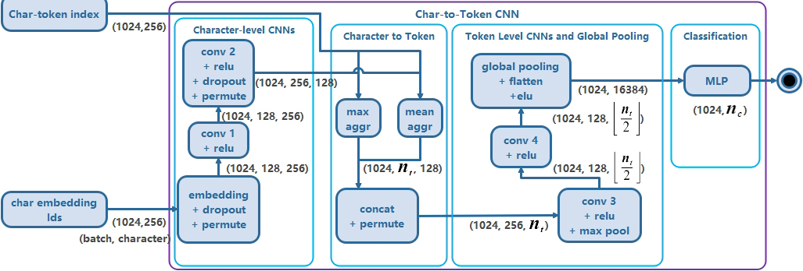

## QuickCharNet: Enhancing Search Engine Optimization Using Efficient Character-Level Convolutional Network for non-optimal URL Detection

## Introduction

This project is part of [Quick Char Net](https://ieeexplore.ieee.org/document/10729268). This project explores the use of deep learning techniques, specifically character-level Convolutional Neural Networks (CNNs), for URL classification. The goal is to classify URLs based on their appearance, which can be used for SEO optimization.

## Project Structure

- **datasets/**: Contains datasets used for training and evaluation.
- **FindBestModel/**: Contains Jupyter notebooks for testing and identifying the best model.
- **TestsOnGrambedding/**: Contains Jupyter notebooks for testing and comparing the model against state-of-the-art models using the Grambedding dataset.
- **TestsOnMaliciousURLs/**: Contains Jupyter notebooks for testing and comparing the model against state-of-the-art models using the Malicious URLs dataset.
- **TestsOnPhishStorm/**: Contains Jupyter notebooks for testing and comparing the model against state-of-the-art models using the PhishStorm dataset.
- **TestsOnSpamURLs/**: Contains Jupyter notebooks for testing and comparing the model against state-of-the-art models using the Spam dataset.
- **Visualizations/**: Python scripts to show how models work include evaluations and how they create their outputs.
## Methodology

### QuickCharNet Architecture


## Dependencies

**_requirements.txt_**: Use this file to install required packages.

## Citation

```bibtext
@ARTICLE{rastakhiz2024quick,
  author={Rastakhiz, Fardin and Eftekhari, Mahdi and Vahdati, Sahar},
  journal={IEEE Access}, 
  title={QuickCharNet: An Efficient URL Classification Framework for Enhanced Search Engine Optimization}, 
  year={2024},
  volume={12},
  number={},
  pages={156965-156979},
  keywords={Search engines;Uniform resource locators;Optimization;Machine learning;Web pages;Text categorization;Accuracy;Semantics;Analytical models;Phishing;Convolutional neural networks;Deep learning;Ranking (statistics);Convolutional neural networks;deep learning;malicious URL detection;text classification;web page ranking},
  doi={10.1109/ACCESS.2024.3484578}}
```

## License
For detailed licensing information, please see the [LICENSE](LICENSE) file.

QuickCharNet, Quick Char Net, Convolutional Neural Network, URL classification, Spam Detection, Search Engine Optimization
